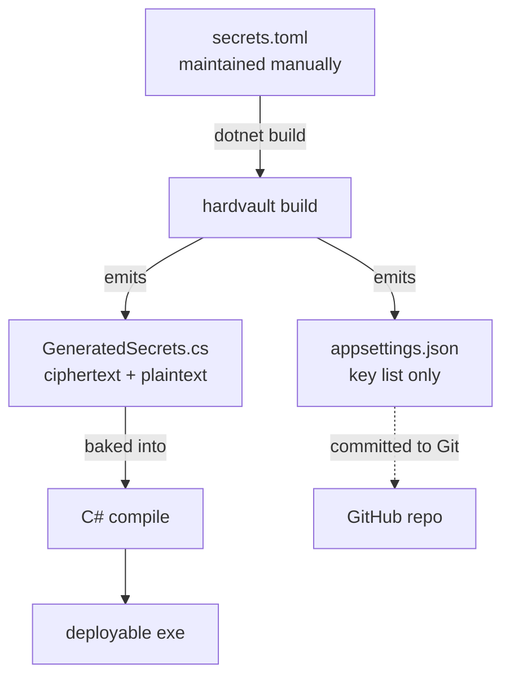
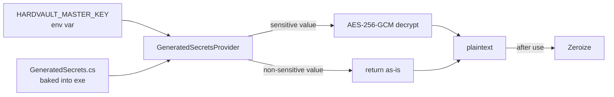

# HARDVAULT

> Encrypt C# config values (including secrets) with AES-256-GCM and bake them into the exe, paired with an external `HARDVAULT_MASTER_KEY` env var as a two-layer defense.

[](https://opensource.org/licenses/MIT)
[](https://dotnet.microsoft.com/)
[](https://www.rust-lang.org/)
[](https://github.com/Jarry6304/hardvault/actions/workflows/ci.yml)
[](#contributing)

繁體中文版：[README.md](README.md)

---

## The Problem

Every C# config-protection scheme eventually faces the same question:

> **Where does the decryption key itself live? (The Key Bootstrap Problem)**

- `appsettings.json` in plaintext → secrets leak directly
- DPAPI / Windows-encrypted → can't move across machines
- Azure Key Vault → costs money, requires Azure
- Roll-your-own → still have to store the key somewhere

**HARDVAULT's answer:** accept that the key has to live *somewhere*, but make the key and the ciphertext **physically separated**. An attacker who gets only one side can't recover the plaintext.

---

## How it works

### Two-layer defense

```
Layer 1: All settings baked into the C# exe
         (sensitive values as AES-256-GCM ciphertext — raises the reverse-engineering bar)
Layer 2: HARDVAULT_MASTER_KEY in an external env var
         (the only thing you have to manage externally)

Missing either layer → plaintext is unrecoverable.
```

### Three files, three roles

| File | Role | In Git? |
|---|---|---|
| `secrets.toml` | Your hand-maintained plaintext source | ❌ |
| `appsettings.json` | Contract file — keys only, no values | ✅ |
| `GeneratedSecrets.cs` | Auto-generated, all values baked into exe | ❌ |

### Honest positioning

This is a *"raise the bar + physical separation"* design, not an enterprise KMS.

- **Best for:** personal projects, small services, side projects
- **Protection level:** plaintext ≪ **HARDVAULT** ≪ Azure Key Vault
- **The real weakness:** developer machine security and key hygiene — not the architecture itself

---

## Architecture

### Build-time flow



### Runtime flow



---

## When to use / not to use

### ✅ Good fit

- Personal side projects deployed to the cloud
- Small services (< 5 person teams)
- No Key Vault budget
- OK with re-compiling on config changes
- Want to protect secrets from public Git repo leaks

### ❌ Not a fit

- Configs need **dynamic updates** (no redeploy allowed)
- Multi-person teams that need to sync secrets frequently
- Need **audit, rotation, version management** for compliance
- **PII / financial / medical** data → use Key Vault / HSM

---

## Comparison

| Scheme | Secret location | Cross-machine | Dynamic update | Cost | Attack bar |
|---|---|---|---|---|---|
| `appsettings.json` plaintext | plaintext file | ✅ | ✅ | Free | Trivial ⚠️ |
| Env vars | plaintext (memory) | ✅ | ✅ | Free | Low |
| DPAPI | encrypted file | ❌ | ✅ | Free | Medium |
| **HARDVAULT** | **ciphertext + exe** | ✅ | ❌ | Free | **Medium-High** |
| Azure Key Vault | KMS service | ✅ | ✅ | Paid | High |
| HSM | hardware module | ⚠️ | ✅ | Expensive | Very High |

---

## Quick Start

### Prerequisites

- .NET 8.0+
- Rust 1.70+
- Windows / Linux / macOS

### Three steps

**1. Generate `HARDVAULT_MASTER_KEY`**

```bash
hardvault keygen
# example output: dGVzdGtleTMyYnl0ZXNiYXNlNjRlbmNvZGVkc3RyaW5n...
```

**2. Set the env var**

```bash
# Windows (CMD)
setx HARDVAULT_MASTER_KEY "your-base64-key"

# Linux / macOS
export HARDVAULT_MASTER_KEY="your-base64-key"
```

**3. Build**

```bash
dotnet build
# Pipeline auto-runs `hardvault build` and produces GeneratedSecrets.cs
```

---

## Full Walk-through

### Step 1: create `secrets.toml`

```toml
[secrets]   # encrypted with AES-256-GCM
LINE_TOKEN   = "ey_xxxxx"
DB_PASSWORD  = "p@ssw0rd"

[config]    # baked in as plaintext
SCAN_CRON    = "0 0 8 * * *"
PAGE_SIZE    = "50"
```

### Step 2: `.gitignore`

```gitignore
secrets.toml
**/GeneratedSecrets.cs
launchSettings.json
hardvault/target/
```

### Step 3: csproj pipeline integration

```xml
<Target Name="HardvaultBuild" BeforeTargets="CoreCompile">
  <Exec Command="hardvault build --input secrets.toml --out-cs Infrastructure/Security/GeneratedSecrets.cs --out-json appsettings.json" />
</Target>
```

> The CLI does **not** accept a `--master-key` flag — the key is only read from `HARDVAULT_MASTER_KEY`. This prevents the key from leaking into shell history or process listings.

### Step 4: register the provider

```csharp
// Program.cs
builder.Services.AddSingleton<ISecretProvider, GeneratedSecretsProvider>();
```

### Step 5: use it

```csharp
public class LineNotifyService
{
    private readonly ISecretProvider _secrets;
    public LineNotifyService(ISecretProvider secrets) => _secrets = secrets;

    public async Task Notify(string message)
    {
        var token = _secrets.Get("LINE_TOKEN");
        // use token...
    }
}
```

For highly sensitive values, prefer `SecretValue` (IDisposable, zeroizes on dispose):

```csharp
using var pwd = _secrets.GetSecret("DB_PASSWORD");
ConnectDatabase(pwd.AsSpan());  // ReadOnlySpan<byte>, zeroed on dispose
```

### Step 6: deploy

```
Production environment:
  1. Upload the exe (no config files needed)
  2. Set HARDVAULT_MASTER_KEY env var
  3. Start
```

> 💡 **Azure App Service:** Add `HARDVAULT_MASTER_KEY` under `Configuration → Application settings`.

---

## Security boundaries

| Attack scenario | Outcome | Why |
|---|---|---|
| Steal the Git repo | ✅ Safe | `appsettings.json` has keys only, no values |
| Steal the compiled exe | ✅ Safe | Ciphertext only — undecryptable without the key |
| Steal `HARDVAULT_MASTER_KEY` | ✅ Safe | No ciphertext, nothing to decrypt |
| Steal **both** exe and key | ❌ Compromised | Environment is fully owned |
| Compromise developer machine | ❌ Compromised | `secrets.toml` leaks — **the biggest weakness** |

### Defensive recommendations

- Enable full-disk encryption on dev machines (BitLocker / FileVault)
- Never write `HARDVAULT_MASTER_KEY` into shell history (`setx` not `set`)
- 2FA on Azure accounts
- Don't put `secrets.toml` in cloud-synced folders (Dropbox, OneDrive, iCloud)
- Use **different** keys for Production and Development

---

## FAQ

### Q1: Why Rust for codegen instead of C#?

Three reasons:
1. **Native binary after compile** — harder to reverse-engineer than .NET IL
2. **`strip` + LTO + `panic=abort`** — symbol table and panic strings essentially removed
3. **Memory safety** — no buffer overflows or use-after-free in the encryption path

### Q2: What if I lose `HARDVAULT_MASTER_KEY`?

All ciphertexts become unrecoverable. You must:
1. Generate a new key (`hardvault keygen`)
2. Recompile (re-encrypts `secrets.toml` with the new key)
3. Redeploy
4. Update env var in all target environments

### Q3: Multi-person collaboration?

Possible, but you need a **shared `secrets.toml` distribution flow** (e.g. 1Password / Bitwarden Secrets Manager). Don't use Slack / Email.

### Q4: How is this different from .NET User Secrets?

User Secrets only work in dev mode — they don't help in Production. This protects both dev and prod.

### Q5: I accidentally committed `GeneratedSecrets.cs`. Now what?

Right now:
1. `git rm --cached **/GeneratedSecrets.cs`
2. Generate a new `HARDVAULT_MASTER_KEY` (treat the old one as leaked)
3. Use `git filter-branch` or BFG Repo-Cleaner to scrub history
4. Force push

---

## Contributing

PRs and bug reports welcome. See [README.md](README.md#貢獻指南) (zh-TW) for the full guide.

### Commit conventions

Follow [Conventional Commits](https://www.conventionalcommits.org/):
- `feat:` new feature
- `fix:` bug fix
- `docs:` documentation
- `refactor:` refactor

### Code style

- C#: [official .NET conventions](https://learn.microsoft.com/dotnet/csharp/fundamentals/coding-style/coding-conventions)
- Rust: `cargo fmt` + `cargo clippy -D warnings`
- Run `dotnet test` + `cargo test` before commit

### Security reports

**Do not open a public issue.** Email the maintainer (see GitHub profile) with `[SECURITY]` in the subject.

---

## Roadmap

- [x] GitHub Actions CI (Rust + .NET cross-platform)
- [x] GitHub Actions Release workflow (pre-built binaries)
- [x] `hardvault rotate` (key rotation tool)
- [ ] CI matrix all-green on Linux / macOS / Windows
- [ ] Docker deployment example
- [ ] HashiCorp Vault integration as `HARDVAULT_MASTER_KEY` source
- [ ] NuGet package release

---

## License

[MIT License](LICENSE). © 2026 Jarry6304.

---

## Acknowledgements

- [AES-GCM in Rust](https://docs.rs/aes-gcm/) — encryption primitive
- [litcrypt](https://docs.rs/litcrypt/) — compile-time string encryption (planned)
- Anthropic Claude — architecture discussion partner

---

<div align="center">

**⭐ If this helped you, please star the repo!**

Made with 🦀 + ☕ in Taipei

</div>
