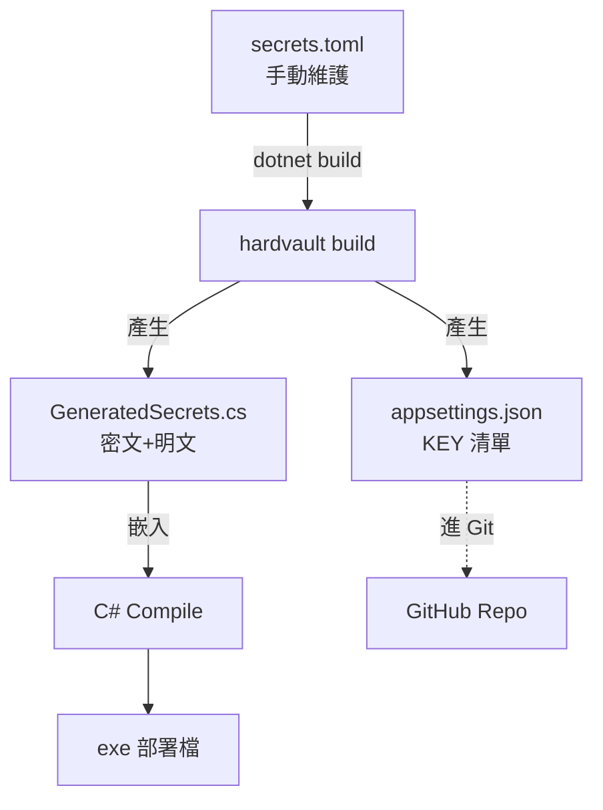
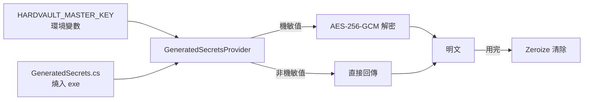

# HARDVAULT

> 將 C# 設定值（含機敏）以 AES-256-GCM 加密後燒入 exe，搭配外部 `HARDVAULT_MASTER_KEY` 環境變數的雙層防線方案。

[](https://opensource.org/licenses/MIT)
[](https://dotnet.microsoft.com/)
[](https://www.rust-lang.org/)
[]()
[](#貢獻指南)

---

## 目錄

- [它解決什麼問題](#它解決什麼問題)
- [核心思想](#核心思想)
- [架構](#架構)
- [適用 / 不適用](#適用--不適用)
- [安全等級比較](#安全等級比較)
- [快速開始](#快速開始)
- [完整使用教學](#完整使用教學)
- [安全邊界](#安全邊界)
- [常見問題 FAQ](#常見問題-faq)
- [貢獻指南](#貢獻指南)
- [授權](#授權)

---

## 它解決什麼問題

所有 C# 設定保護方案最終都面對同一個問題：

> **解密鑰匙本身要放哪？（Key Bootstrap Problem）**

- `appsettings.json` 裸奔 → 機敏值直接外洩
- DPAPI / Windows 加密 → 跨機器搬遷困難
- Azure Key Vault → 有預算門檻、需 Azure 帳號
- 自製加密 → 還是要存解密金鑰

**HARDVAULT 的選擇：** 接受「金鑰必須存在某處」這個事實，但讓金鑰與密文**物理隔離**。攻擊者只拿到其中一邊都無法還原。

---

## 核心思想

### 兩層防線

```
層一：所有設定值燒死在 C# exe 內（機敏值為密文，提高逆向門檻）
層二：HARDVAULT_MASTER_KEY 存於外部環境變數（唯一需外部管理的值）

缺任何一層 → 無法還原明文
```

### 三檔分工

| 檔案 | 角色 | 進 Git |
|---|---|---|
| `secrets.toml` | 你維護的唯一明文來源 | ❌ |
| `appsettings.json` | 契約文件，只有 KEY 無 VALUE | ✅ |
| `GeneratedSecrets.cs` | Pipeline 自動產生，所有值燒入 exe | ❌ |

### 本質定位

這是「**提高逆向門檻 + 雙層防線**」的設計，不是企業級 KMS。

- 適合：個人專案、小型服務、Side Project
- 保護等級：明文 ≪ **HARDVAULT** ≪ Azure Key Vault
- 真正的弱點：開發機安全與 `HARDVAULT_MASTER_KEY` 管理習慣，不在架構本身

---

## 架構

### 開發期流程



### 執行期流程



---

## 適用 / 不適用

### ✅ 適合場景

- 個人 Side Project 部署到雲端
- 小型服務（< 5 人團隊）
- 無 Key Vault 預算
- 可接受設定變更時重新編譯部署
- 想保護機敏值避免被 Git 公開倉庫洩漏

### ❌ 不適合場景

- 設定需要**動態更新**（不允許重新部署）
- 多人協作且機敏值需在團隊間頻繁同步
- 需要**審計、輪替、版本管理**的企業合規場景
- 處理**個資 / 金流 / 醫療**等高敏感資料 → 請用 Key Vault / HSM

---

## 安全等級比較

| 方案 | 機敏值位置 | 跨機器 | 動態更新 | 預算 | 攻擊門檻 |
|---|---|---|---|---|---|
| `appsettings.json` 裸奔 | 明文檔案 | ✅ | ✅ | 免費 | 極低 ⚠️ |
| 環境變數 | 明文（記憶體） | ✅ | ✅ | 免費 | 低 |
| DPAPI | 加密檔案 | ❌ | ✅ | 免費 | 中 |
| **HARDVAULT** | **密文+exe** | ✅ | ❌ | 免費 | **中高** |
| Azure Key Vault | KMS 服務 | ✅ | ✅ | 付費 | 高 |
| HSM | 硬體加密模組 | ⚠️ | ✅ | 高 | 極高 |

---

## 快速開始

### 前置需求

- .NET 8.0+
- Rust 1.70+
- Windows / Linux / macOS

### 三步驟

**1. 產生 HARDVAULT_MASTER_KEY**

```bash
hardvault keygen
# 輸出範例: dGVzdGtleTMyYnl0ZXNiYXNlNjRlbmNvZGVkc3RyaW5n...
```

**2. 設定環境變數**

```bash
# Windows (CMD)
setx HARDVAULT_MASTER_KEY "你的-base64-金鑰"

# Linux / macOS
export HARDVAULT_MASTER_KEY="你的-base64-金鑰"
```

**3. 編譯**

```bash
dotnet build
# Pipeline 自動執行 hardvault build，產生 GeneratedSecrets.cs
```

---

## 完整使用教學

### Step 1：建立 secrets.toml

```toml
[secrets]   # 機敏值 → AES-256-GCM 加密
LINE_TOKEN   = "ey_xxxxx"
DB_PASSWORD  = "p@ssw0rd"

[config]    # 非機敏值 → 明文燒入
SCAN_CRON    = "0 0 8 * * *"
PAGE_SIZE    = "50"
```

### Step 2：設定 .gitignore

```gitignore
secrets.toml
Infrastructure/Security/GeneratedSecrets.cs
launchSettings.json
hardvault/target/
```

### Step 3：整合 csproj Pipeline

```xml
<Target Name="HardvaultBuild" BeforeTargets="BeforeBuild">
  <Exec Command="hardvault build --input secrets.toml --out-cs Infrastructure/Security/GeneratedSecrets.cs --out-json appsettings.json" />
</Target>

<Target Name="HardvaultValidate" AfterTargets="HardvaultBuild" BeforeTargets="BeforeBuild">
  <Error
    Condition="!Exists('Infrastructure/Security/GeneratedSecrets.cs')"
    Text="GeneratedSecrets.cs 不存在，請確認 hardvault build 執行成功且 HARDVAULT_MASTER_KEY 已設定" />
</Target>
```

> 注意：CLI 不接受 `--master-key` 參數，金鑰只從 `HARDVAULT_MASTER_KEY` 環境變數讀取，避免寫進 shell history 與 process list。

### Step 4：C# 註冊 Provider

```csharp
// Program.cs
builder.Services.AddSingleton<ISecretProvider, GeneratedSecretsProvider>();
```

### Step 5：取值使用

```csharp
public class LineNotifyService
{
    private readonly ISecretProvider _secrets;

    public LineNotifyService(ISecretProvider secrets) => _secrets = secrets;

    public async Task Notify(string message)
    {
        var token = _secrets.Get("LINE_TOKEN");
        // 使用 token...
    }
}
```

### Step 6：部署

```
部署目標環境：
  1. 上傳 exe（不需任何設定檔）
  2. 設定環境變數 HARDVAULT_MASTER_KEY
  3. 啟動
```

> 💡 **Azure App Service：** 在 `Configuration → Application settings` 加入 `HARDVAULT_MASTER_KEY`。

---

## 安全邊界

| 攻擊情境 | 結果 | 說明 |
|---|---|---|
| 拿到 Git repo | ✅ 安全 | `appsettings.json` 只有 KEY，無 VALUE |
| 拿到編譯後 exe | ✅ 安全 | 只有密文，無 `HARDVAULT_MASTER_KEY` 無法解 |
| 拿到 `HARDVAULT_MASTER_KEY` | ✅ 安全 | 沒有密文來源，無法解 |
| 同時拿到 exe + `HARDVAULT_MASTER_KEY` | ❌ 淪陷 | 環境已全面失守 |
| 開發機被入侵 | ❌ 淪陷 | `secrets.toml` 外洩，**最大弱點** |

### 防禦建議

- 開發機開啟磁碟加密（BitLocker / FileVault）
- `HARDVAULT_MASTER_KEY` 不要寫進 shell history（用 `setx` 不用 `set`）
- Azure 帳號開啟 2FA
- `secrets.toml` 不要放雲端硬碟同步資料夾
- Production / Development 使用**不同** `HARDVAULT_MASTER_KEY`

---

## 常見問題 FAQ

### Q1：為什麼用 Rust 寫 codegen，不用 C# 寫？

A：三個原因：
1. **編譯後是 native binary**，逆向難度高於 .NET IL
2. **litcrypt + strip + LTO** 可徹底移除符號表與字串
3. **記憶體安全**，避免 buffer overflow 等漏洞

### Q2：HARDVAULT_MASTER_KEY 弄丟了怎麼辦？

A：所有密文無法還原，必須：
1. 重新產生 `HARDVAULT_MASTER_KEY`（`hardvault keygen`）
2. 重新編譯（會用新 key 加密 `secrets.toml`）
3. 重新部署
4. 更新所有目標環境的環境變數

### Q3：可以多人協作嗎？

A：可以，但需建立**共享 secrets.toml 傳遞流程**（例如 1Password / Bitwarden Secrets Manager）。不要用 Slack / Email 傳。

### Q4：跟 .NET 內建的 User Secrets 差在哪？

A：User Secrets 只在開發期有效，部署到 Production 無作用。本方案開發期 + 部署期都保護。

### Q5：密文檔案不小心 commit 了怎麼辦？

A：立即執行：
1. `git rm --cached **/GeneratedSecrets.cs`
2. 重新產生 `HARDVAULT_MASTER_KEY`（舊的視為已洩漏）
3. 用 `git filter-branch` 或 BFG Repo-Cleaner 清除歷史
4. Force push

---

## 貢獻指南

### 歡迎的貢獻

- 🐛 Bug 回報
- ✨ 新功能 PR
- 📖 文件改善
- 🌐 翻譯（目前僅繁中）
- 🧪 增加測試覆蓋率

### 提交流程

1. **Fork** 本專案
2. 建立 feature branch：`git checkout -b feat/your-feature`
3. Commit 訊息遵循 [Conventional Commits](https://www.conventionalcommits.org/)
   - `feat:` 新功能
   - `fix:` Bug 修復
   - `docs:` 文件
   - `refactor:` 重構
4. **Push** 到你的 fork
5. 開 **Pull Request** 到 `main`

### 程式碼風格

- C#：遵循 [.NET 官方規範](https://learn.microsoft.com/dotnet/csharp/fundamentals/coding-style/coding-conventions)
- Rust：執行 `cargo fmt` + `cargo clippy`
- Commit 前確認 `dotnet test` + `cargo test` 全綠

### 回報安全問題

**請勿開 Public Issue。** 直接寄信至維護者信箱（見 GitHub Profile），主旨開頭加 `[SECURITY]`。

### 行為準則

本專案遵循 [Contributor Covenant](https://www.contributor-covenant.org/)。請以尊重、建設性的態度互動。

---

## 路線圖 Roadmap

- [ ] 支援 Linux / macOS 平台測試
- [ ] 增加 GitHub Actions CI/CD 範本
- [ ] 提供 Docker 部署範例
- [ ] 支援密文輪替工具（`hardvault rotate`）
- [ ] 整合 HashiCorp Vault 作為 `HARDVAULT_MASTER_KEY` 來源
- [ ] NuGet Package 發布

---

## 授權

本專案採用 [MIT License](LICENSE) 授權。

```
MIT License

Copyright (c) 2026 Jarry6304

Permission is hereby granted, free of charge, to any person obtaining a copy
of this software and associated documentation files (the "Software"), to deal
in the Software without restriction, including without limitation the rights
to use, copy, modify, merge, publish, distribute, sublicense, and/or sell
copies of the Software, and to permit persons to whom the Software is
furnished to do so, subject to the following conditions:

The above copyright notice and this permission notice shall be included in all
copies or substantial portions of the Software.

THE SOFTWARE IS PROVIDED "AS IS", WITHOUT WARRANTY OF ANY KIND, EXPRESS OR
IMPLIED, INCLUDING BUT NOT LIMITED TO THE WARRANTIES OF MERCHANTABILITY,
FITNESS FOR A PARTICULAR PURPOSE AND NONINFRINGEMENT. IN NO EVENT SHALL THE
AUTHORS OR COPYRIGHT HOLDERS BE LIABLE FOR ANY CLAIM, DAMAGES OR OTHER
LIABILITY, WHETHER IN AN ACTION OF CONTRACT, TORT OR OTHERWISE, ARISING FROM,
OUT OF OR IN CONNECTION WITH THE SOFTWARE OR THE USE OR OTHER DEALINGS IN THE
SOFTWARE.
```

---

## 致謝

- [AES-GCM in Rust](https://docs.rs/aes-gcm/) - 加密實作
- [litcrypt](https://docs.rs/litcrypt/) - 字串編譯期加密
- Anthropic Claude - 架構設計討論夥伴

---

<div align="center">

**⭐ 如果這個專案對你有幫助，請給個 Star！**

Made with 🦀 + ☕ in Taipei

</div>
