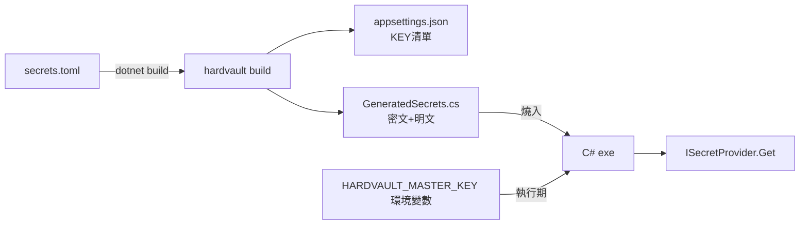

# HARDVAULT

## 何時使用

- C# 專案需要保護 appsettings.json 中的機敏值
- 無 Azure Key Vault / AWS Secrets Manager 預算
- 可接受設定變更時重新編譯部署

## 不適用

- 設定需要動態更新（不重新部署）
- 多人協作且機敏值需在團隊間同步
- 需要審計、輪替、版本管理的企業級場景 → 用 Key Vault

## 三檔角色

| 檔案 | 內容 | 進 Git |
|---|---|---|
| `secrets.toml` | 明文來源，手動維護 | ❌ |
| `appsettings.json` | 只有 KEY 無 VALUE，契約文件 | ✅ |
| `GeneratedSecrets.cs` | 密文+明文，自動產生 | ❌ |

## 流程



## secrets.toml 格式

```toml
[secrets]   # 機敏值 → AES-256-GCM 加密
LINE_TOKEN   = "ey_xxxxx"
DB_PASSWORD  = "p@ssw0rd"

[config]    # 非機敏值 → 明文燒入
SCAN_CRON    = "0 0 8 * * *"
PAGE_SIZE    = "50"
```

## 執行步驟

1. 維護 `secrets.toml`（新增/修改機敏值）
2. 確認 `HARDVAULT_MASTER_KEY` 環境變數已設定（`hardvault keygen` 產生）
3. `dotnet build` → 自動觸發 `hardvault build` → 產生兩個檔案 → 編譯
4. 部署 exe（無設定檔）+ 目標環境設定 `HARDVAULT_MASTER_KEY`

## 強制規則

- `secrets.toml`、`GeneratedSecrets.cs` 必須在 `.gitignore`
- `HARDVAULT_MASTER_KEY` 為 32 bytes random，base64 編碼
- CLI **不接受** `--master-key` 旗標（避免進入 shell history / process list），金鑰只從環境變數讀取
- 解密後的明文使用完畢必須 `CryptographicOperations.ZeroMemory` 清除
- hardvault 編譯必須使用 release profile（strip、lto、panic=abort）
- 密文中 nonce 前 12 bytes、tag 後 16 bytes，每次加密重新產生 nonce

## 安全邊界

| 攻擊面 | 防護 |
|---|---|
| Git repo 外洩 | ✅ 只有 KEY 無 VALUE |
| exe 外洩 | ✅ 無 HARDVAULT_MASTER_KEY 不可解 |
| HARDVAULT_MASTER_KEY 外洩 | ✅ 無密文不可解 |
| exe + HARDVAULT_MASTER_KEY 同時外洩 | ❌ 環境已淪陷 |
| 開發機入侵 | ❌ secrets.toml 外洩（最大弱點） |

## 參考實作

- csproj pipeline 整合 → `reference/csproj-target.xml`
- C# Provider 完整實作 → `reference/GeneratedSecretsProvider.cs`
- hardvault CLI 加密與保護 → `reference/hardvault_cli_notes.md`
- HARDVAULT_MASTER_KEY 產生腳本 → `reference/generate_master_key.rs`
